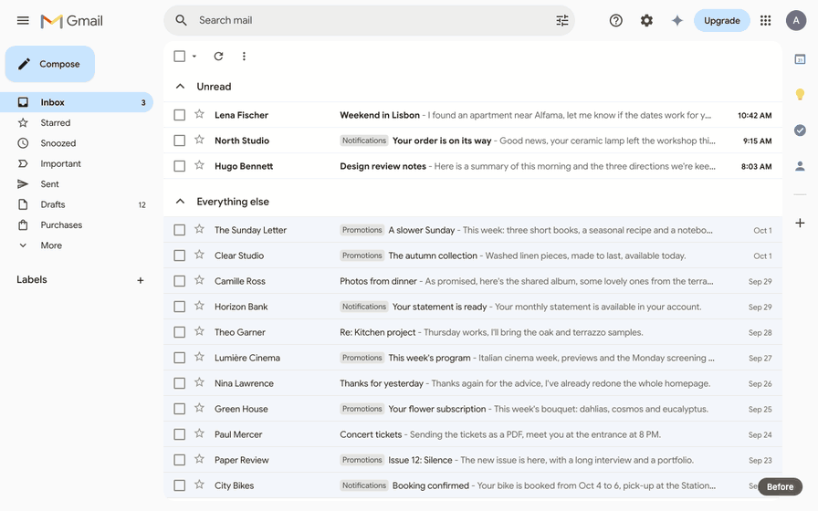

# Gmail Zen

A quieter, monochrome Gmail. Gmail Zen is a small Chrome extension that restyles Gmail in your browser: fewer buttons, warm greys, generous space and a single touch of orange. It doesn't touch your email, your account or any server. Everything happens in the page you're looking at.

It's a personal project, built to make Gmail feel calm and focused.

*Both recreated with invented emails.*

## Design direction

Gmail Zen keeps only what you use to read and write email. One centered column, generous space, no dividers, no labels or counters. Hierarchy comes from type (Inter, few sizes) rather than boxes.

The palette is warm and neutral: an off-white page, near-black text, warm greys and no blue. A single orange marks only what's new and the main action: the unread dot, "Write" and "Send".

Depth comes from soft shadows and blur instead of lines. Motion is quick for everyday actions and slower for rare moments, like the writing sheet rising or the pastel light that appears when a new email arrives.

## What it changes

**Inbox**
- Hides the clutter: logo, help, settings, Gemini, upgrade button, apps grid, avatar, side panel, labels, checkboxes, label chips, counters and footer.
- A centered column with soft warm greys and Inter.
- "Unread" shows an orange dot with your unread count, and the dot disappears when there's nothing to read.
- When a new email arrives, the other emails blur for a moment so it stands alone, and a soft pastel sunlight rises from the bottom of the window like a small sunrise, then fades.
- "Everything else" lists read emails only, softly blurring and fading into the page toward the bottom.

**Menu**
- The hamburger opens a small floating pill of icons (inbox, starred, sent) with a springy animation, and morphs into a close icon.

**Writing**
- The orange "Write" button opens a writing sheet that rises from the bottom center of the window and stops just under the header, while the inbox behind it blurs and dims. It slides back down when you close or send.
- One centered column, quiet tool icons, and an orange "Send" button that glows on hover.

Animations turn themselves off when "Reduce motion" is enabled in macOS accessibility settings.

## Install

The extension isn't on the Chrome Web Store. You load it yourself in a few seconds:

1. Download this repository (green **Code** button, then **Download ZIP**) and unzip it, or clone it.
2. Open `chrome://extensions` in Chrome (or any Chromium browser).
3. Turn on **Developer mode** (top right).
4. Click **Load unpacked** and select the `extension` folder.
5. Reload Gmail.

After changing a file, click the reload arrow on the extension's card in `chrome://extensions`, then reload Gmail.

## Customize

Most of the look is controlled by variables at the top of [`extension/clean.css`](extension/clean.css), so you can adjust it without touching the rest:

| Variable | What it controls |
|---|---|
| `--cg-bg`, `--cg-text`, `--cg-text-muted` | Page background and text colors |
| `--cg-accent` | The orange (unread dot, "Write" and "Send" buttons) |
| `--cg-content-width` | Width of the inbox column |
| `--cg-search-width` | Width of the search bar |
| `--cg-row-padding` | Height of each email row |
| `--cg-compose-column` | Width of the writing column |
| `--cg-fade-height` | Height of the fade at the bottom of the inbox |

## How it works

- [`extension/clean.css`](extension/clean.css) does almost everything: hiding, colors, type, layout and animations.
- [`extension/content.js`](extension/content.js) handles the things CSS can't do alone: showing the unread count next to "Unread", spotting new arrivals, and playing the closing animation of the compose window (Gmail removes it instantly, so the script slides a copy away in its place).
- No permissions, no network requests of its own (apart from loading the Inter font from Google Fonts), no data collected.

## Limits

- **Gmail can break it.** Gmail's class names are auto-generated and change when Google ships updates. If something reappears or looks off, the rule targeting it probably needs a new selector.
- **Built on a French Gmail.** Most rules don't depend on the language, but it has only been used with the French interface and the "Unread first" inbox type.
- **Some features are hidden on purpose,** like settings and the avatar. Settings stay reachable at `mail.google.com/mail/u/0/#settings/general`.

## License notes

- The back arrow icon is Material's "arrow back" (Apache License 2.0).
